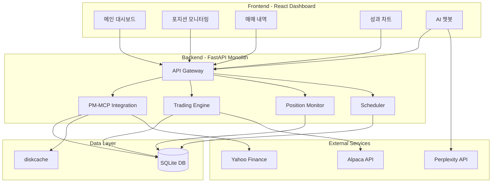

# 01. 개인용 자동매매 시스템 아키텍처

> **최적화 버전**: 간소화된 모놀리식 구조
> **목표**: 로컬 환경에서 무료로 운영 가능한 시스템

---

## 📐 시스템 설계 철학

### 핵심 원칙
1. **간소함 (Simplicity)**: 복잡한 마이크로서비스 대신 단일 애플리케이션
2. **무료 (Zero Cost)**: 모든 API 무료 tier 활용, 클라우드 제거
3. **재사용 (Reusability)**: PM-MCP 기능 100% 활용, 중복 개발 제거
4. **안정성 (Reliability)**: 철저한 리스크 관리, Paper Trading 우선

---

## 🏗 전체 아키텍처



---

## 🧩 컴포넌트 상세

### Frontend (React + Vite)

**역할**: 사용자 인터페이스 및 실시간 모니터링

```typescript
// 주요 컴포넌트 구조
├── Dashboard.tsx           // 메인 대시보드
│   ├── PortfolioSummary    // 총 자산, 수익률
│   ├── PositionList        // 현재 포지션
│   └── RecentTrades        // 최근 매매
│
├── Trading.tsx             // 매매 관리
│   ├── ManualTrade         // 수동 주문
│   ├── StrategyConfig      // 전략 설정
│   └── RiskSettings        // 리스크 설정
│
├── Analytics.tsx           // 성과 분석
│   ├── PerformanceChart    // 수익률 차트
│   ├── DrawdownChart       // 낙폭 분석
│   └── TradeStats          // 매매 통계
│
└── Chatbot.tsx            // AI 챗봇 (사이드바)
    ├── ChatWindow          // 대화창
    ├── QuickActions        // 빠른 명령
    └── PMCPIntegration     // PM-MCP 결과
```

**기술 스택**
- React 18 (Functional Components + Hooks)
- Vite (빠른 빌드)
- Tailwind CSS (스타일링)
- Recharts (차트)
- Zustand (전역 상태)
- React Query (서버 상태)
- EventSource (실시간 SSE)

---

### Backend (FastAPI Monolith)

**역할**: 비즈니스 로직, API, 스케줄링

#### 1. PM-MCP Integration Layer
```python
# services/pm_mcp_integration.py
class PMCPIntegration:
    """PM-MCP 기능을 래핑하여 제공"""

    @staticmethod
    async def get_top_stocks(count: int = 10):
        """상위 종목 선정 (ranking_advanced)"""
        from mcp_server.tools.ranking_engine import ranking_advanced
        result = await ranking_advanced(
            tickers_csv=WATCHLIST_TICKERS,
            use_sector_weights=True,
            use_market_adjustment=True
        )
        return result[:count]

    @staticmethod
    async def analyze_sentiment(ticker: str):
        """뉴스 감성 분석"""
        from mcp_server.tools.news_sentiment import news_sentiment_analyze
        return await news_sentiment_analyze(
            tickers_csv=ticker,
            lookback_days=7
        )

    @staticmethod
    async def evaluate_portfolio(holdings: str):
        """포트폴리오 평가"""
        from mcp_server.tools.portfolio_manager import portfolio_comprehensive
        return await portfolio_comprehensive(
            holdings_text=holdings,
            cash=0
        )
```

#### 2. Trading Engine
```python
# services/strategy_engine.py
class StrategyEngine:
    """매매 전략 실행 엔진"""

    async def evaluate_entry(self, ticker: str) -> bool:
        """진입 조건 평가"""
        # 1. PM-MCP 랭킹 확인
        ranking = await pmcp.get_top_stocks()
        if ticker not in [s['ticker'] for s in ranking]:
            return False

        # 2. 뉴스 감성 확인
        sentiment = await pmcp.analyze_sentiment(ticker)
        if sentiment['overall'] == 'bearish':
            return False

        # 3. 포지션 한도 확인
        if await self.position_limit_reached():
            return False

        return True

    async def evaluate_exit(self, position: Position) -> bool:
        """청산 조건 평가"""
        current_price = await self.get_current_price(position.ticker)
        pnl_pct = (current_price - position.avg_price) / position.avg_price

        # 이익 실현
        if pnl_pct >= 0.20:  # +20%
            return True

        # 손절
        if pnl_pct <= -0.05:  # -5%
            return True

        # 시간 손절
        days_held = (datetime.now() - position.entry_date).days
        if days_held > 7:
            return True

        return False
```

#### 3. Alpaca Broker Integration
```python
# services/broker_alpaca.py
class AlpacaBroker:
    """Alpaca API 래퍼"""

    def __init__(self):
        self.api = tradeapi.REST(
            key_id=os.getenv('ALPACA_API_KEY'),
            secret_key=os.getenv('ALPACA_SECRET_KEY'),
            base_url='https://paper-api.alpaca.markets',  # Paper Trading
            api_version='v2'
        )

    async def place_market_order(
        self,
        ticker: str,
        qty: int,
        side: str  # 'buy' or 'sell'
    ):
        """시장가 주문"""
        return self.api.submit_order(
            symbol=ticker,
            qty=qty,
            side=side,
            type='market',
            time_in_force='day'
        )

    async def get_positions(self):
        """현재 포지션 조회"""
        return self.api.list_positions()

    async def get_account(self):
        """계좌 정보 조회"""
        return self.api.get_account()
```

#### 4. Scheduler (APScheduler 활용)
```python
# scheduler/trading_tasks.py
from apscheduler.schedulers.asyncio import AsyncIOScheduler

scheduler = AsyncIOScheduler()

@scheduler.scheduled_job('cron', hour=9, minute=0)  # 매일 09:00
async def morning_scan():
    """아침 종목 스캔 및 매수"""
    logger.info("Morning scan started")

    # 1. 상위 종목 선정
    top_stocks = await pmcp.get_top_stocks(count=10)

    # 2. 각 종목 평가 및 매수
    for stock in top_stocks:
        if await strategy.evaluate_entry(stock['ticker']):
            await broker.place_market_order(
                ticker=stock['ticker'],
                qty=calculate_position_size(stock),
                side='buy'
            )

@scheduler.scheduled_job('interval', minutes=5)
async def monitor_positions():
    """포지션 모니터링 및 청산"""
    positions = await broker.get_positions()

    for pos in positions:
        if await strategy.evaluate_exit(pos):
            await broker.place_market_order(
                ticker=pos.ticker,
                qty=pos.qty,
                side='sell'
            )
```

---

### Database Schema (SQLite)

```sql
-- 매매 내역
CREATE TABLE trades (
    id INTEGER PRIMARY KEY AUTOINCREMENT,
    ticker VARCHAR(10) NOT NULL,
    side VARCHAR(4) NOT NULL,  -- 'buy' or 'sell'
    quantity INTEGER NOT NULL,
    price DECIMAL(10, 2) NOT NULL,
    amount DECIMAL(12, 2) NOT NULL,
    commission DECIMAL(8, 2) DEFAULT 0,
    timestamp DATETIME DEFAULT CURRENT_TIMESTAMP,
    order_id VARCHAR(50) UNIQUE,
    status VARCHAR(20) DEFAULT 'filled'
);

-- 현재 포지션
CREATE TABLE positions (
    id INTEGER PRIMARY KEY AUTOINCREMENT,
    ticker VARCHAR(10) UNIQUE NOT NULL,
    quantity INTEGER NOT NULL,
    avg_price DECIMAL(10, 2) NOT NULL,
    current_price DECIMAL(10, 2),
    unrealized_pnl DECIMAL(12, 2),
    unrealized_pnl_pct DECIMAL(6, 2),
    entry_date DATETIME NOT NULL,
    last_update DATETIME DEFAULT CURRENT_TIMESTAMP
);

-- 주문 내역
CREATE TABLE orders (
    id INTEGER PRIMARY KEY AUTOINCREMENT,
    order_id VARCHAR(50) UNIQUE NOT NULL,
    ticker VARCHAR(10) NOT NULL,
    side VARCHAR(4) NOT NULL,
    type VARCHAR(20) NOT NULL,  -- 'market', 'limit', etc.
    quantity INTEGER NOT NULL,
    filled_qty INTEGER DEFAULT 0,
    price DECIMAL(10, 2),
    status VARCHAR(20) NOT NULL,  -- 'pending', 'filled', 'canceled'
    created_at DATETIME DEFAULT CURRENT_TIMESTAMP,
    filled_at DATETIME
);

-- 성과 스냅샷 (일별)
CREATE TABLE performance (
    id INTEGER PRIMARY KEY AUTOINCREMENT,
    date DATE UNIQUE NOT NULL,
    portfolio_value DECIMAL(12, 2) NOT NULL,
    cash DECIMAL(12, 2) NOT NULL,
    total_value DECIMAL(12, 2) NOT NULL,
    daily_return DECIMAL(6, 4),
    cumulative_return DECIMAL(8, 4),
    sharpe_ratio DECIMAL(6, 4),
    max_drawdown DECIMAL(6, 4)
);
```

---

## 🔄 핵심 워크플로우

### 1. 자동 매매 플로우
```
09:00 (시장 오픈 전)
  ↓
PM-MCP ranking_advanced() 실행
  ↓
상위 10개 종목 선정
  ↓
각 종목 news_sentiment 분석
  ↓
부정적 종목 제외
  ↓
포지션 사이징 계산
  ↓
Alpaca 시장가 매수 주문
  ↓
DB에 trade 기록
```

### 2. 포지션 모니터링 플로우 (5분마다)
```
현재 포지션 조회
  ↓
각 포지션에 대해:
  ├─ 현재가 업데이트
  ├─ 손익 계산
  └─ 청산 조건 체크
      ↓ (조건 만족 시)
      Alpaca 매도 주문
      ↓
      DB 업데이트
```

### 3. 실시간 UI 업데이트
```
Backend SSE Endpoint
  ↓
EventSource 연결
  ↓
매 1초마다 데이터 푸시:
  ├─ 포지션 현황
  ├─ 계좌 잔액
  └─ 최근 주문
  ↓
React 컴포넌트 자동 갱신
```

---

## 🛡 리스크 관리 시스템

### 포지션 제한
```python
class RiskManager:
    MAX_POSITIONS = 10              # 최대 10개 종목
    MAX_POSITION_PCT = 0.15         # 단일 종목 15%
    MIN_CASH_PCT = 0.20             # 현금 20% 유지

    def can_open_position(self, ticker: str, amount: float) -> bool:
        """새 포지션 개설 가능 여부"""
        # 1. 포지션 개수 확인
        if len(self.positions) >= self.MAX_POSITIONS:
            return False

        # 2. 비중 확인
        total_value = self.get_total_value()
        if amount / total_value > self.MAX_POSITION_PCT:
            return False

        # 3. 현금 비중 확인
        remaining_cash = self.cash - amount
        if remaining_cash / total_value < self.MIN_CASH_PCT:
            return False

        return True
```

### 손실 제한
```python
class LossLimits:
    STOP_LOSS_PCT = 0.05           # 단일 종목 손절 -5%
    DAILY_LOSS_LIMIT = 0.03        # 일일 손실 -3%
    MONTHLY_LOSS_LIMIT = 0.10      # 월간 손실 -10%
    MAX_DRAWDOWN_LIMIT = 0.20      # 최대 낙폭 -20%

    def check_limits(self):
        """손실 한도 체크 및 거래 중단"""
        if self.daily_loss() <= -self.DAILY_LOSS_LIMIT:
            self.halt_trading("Daily loss limit reached")

        if self.max_drawdown() <= -self.MAX_DRAWDOWN_LIMIT:
            self.halt_trading("Max drawdown limit reached")
            self.close_all_positions()
```

---

## 📊 성과 추적

### 메트릭 계산
```python
class PerformanceTracker:
    """성과 지표 계산"""

    def calculate_sharpe_ratio(self, returns: List[float]) -> float:
        """샤프 비율 (연환산)"""
        mean_return = np.mean(returns)
        std_return = np.std(returns)
        return (mean_return / std_return) * np.sqrt(252) if std_return > 0 else 0

    def calculate_max_drawdown(self, values: List[float]) -> float:
        """최대 낙폭"""
        peak = values[0]
        max_dd = 0
        for value in values:
            if value > peak:
                peak = value
            dd = (value - peak) / peak
            if dd < max_dd:
                max_dd = dd
        return max_dd

    def calculate_win_rate(self) -> float:
        """승률"""
        trades = self.get_closed_trades()
        winning = sum(1 for t in trades if t.pnl > 0)
        return winning / len(trades) if trades else 0
```

---

## 🔌 API 엔드포인트 설계

```python
# main.py
from fastapi import FastAPI, Query
from fastapi.responses import StreamingResponse

app = FastAPI()

# 포트폴리오
@app.get("/api/portfolio")
async def get_portfolio():
    """포트폴리오 요약"""
    return {
        "total_value": 10000,
        "cash": 2000,
        "positions_value": 8000,
        "unrealized_pnl": 500,
        "return_pct": 5.0
    }

# 포지션
@app.get("/api/positions")
async def get_positions():
    """현재 포지션 목록"""
    return await db.get_all_positions()

# 매매 내역
@app.get("/api/trades")
async def get_trades(
    limit: int = Query(50, le=100),
    offset: int = 0
):
    """매매 내역 조회"""
    return await db.get_trades(limit, offset)

# 실시간 스트림 (SSE)
@app.get("/api/stream")
async def stream_updates():
    """실시간 업데이트 스트림"""
    async def event_generator():
        while True:
            data = await get_realtime_data()
            yield f"data: {json.dumps(data)}\n\n"
            await asyncio.sleep(1)

    return StreamingResponse(
        event_generator(),
        media_type="text/event-stream"
    )

# AI 챗봇
@app.post("/api/chatbot")
async def chatbot(message: str):
    """AI 챗봇 대화"""
    # Perplexity API 호출
    response = await perplexity_chat(message)
    # PM-MCP 데이터 추가
    context = await pmcp.get_relevant_data(message)
    return {"response": response, "context": context}
```

---

## 🚀 배포 및 실행

### 로컬 개발
```bash
# Backend
cd stock-manager/backend
python -m venv venv
source venv/bin/activate
pip install -r requirements.txt
uvicorn main:app --reload --port 8000

# Frontend
cd stock-manager/frontend
npm install
npm run dev
```

### 프로덕션 (24/7 백그라운드)
```bash
# PM2 사용
pm2 start ecosystem.config.js
pm2 save
pm2 startup

# 또는 systemd
sudo cp stock-manager.service /etc/systemd/system/
sudo systemctl enable stock-manager
sudo systemctl start stock-manager
```

### Docker (선택사항)
```yaml
# docker-compose.yml
version: '3.8'
services:
  backend:
    build: ./backend
    ports:
      - "8000:8000"
    volumes:
      - ./data:/app/data
      - ../mcp_server:/app/mcp_server
    env_file:
      - ../.env

  frontend:
    build: ./frontend
    ports:
      - "3000:3000"
    depends_on:
      - backend
```

---

## 📈 확장 가능성

### 단계적 확장 경로
1. **Phase 1** (현재): Paper Trading, 단일 전략
2. **Phase 2**: 실거래 소액, 다중 전략
3. **Phase 3**: PostgreSQL 전환, 백테스팅 강화
4. **Phase 4**: 옵션 거래, 포트폴리오 최적화

### 필요 시 추가 가능
- **Redis**: 높은 동시 접속 처리
- **TimescaleDB**: 대용량 시계열 데이터
- **Kubernetes**: 멀티 인스턴스 배포
- **Prometheus/Grafana**: 고급 모니터링

---

## ✅ 아키텍처 장점 요약

| 특징 | 설명 |
|------|------|
| **간단함** | 단일 FastAPI 앱, SQLite, 최소 의존성 |
| **무료** | 모든 API 무료 tier, 로컬 실행 |
| **빠른 개발** | PM-MCP 재사용으로 70% 시간 절약 |
| **안정성** | Paper Trading, 철저한 리스크 관리 |
| **확장성** | 필요 시 점진적 확장 가능 |
| **유지보수** | 적은 컴포넌트, 명확한 구조 |

---

**이 아키텍처는 개인 투자자가 안전하게 자동매매를 시작할 수 있는 최적의 구조입니다.** 🎯
